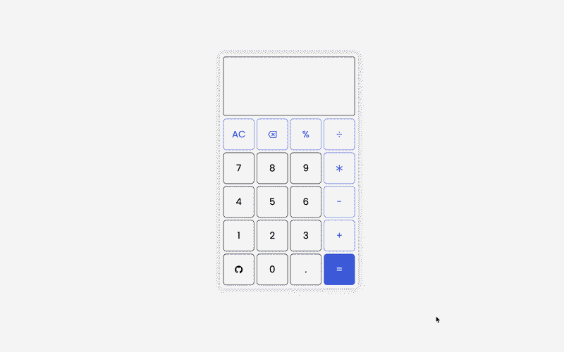

# 🧮 Calculator App

A simple calculator web application built using HTML, CSS, and Vanilla JavaScript.  
This project focuses on strengthening core JavaScript fundamentals, DOM manipulation, and logical thinking.

## 🎥 Calculator Preview

  

## 🚀 Features

- Basic arithmetic operations (+, −, ×, ÷)  
- Interactive button-based input  
- Clear (reset) functionality  
- Real-time display updates  
- Responsive layout  

## 🛠️ Tech Stack

- HTML5  
- CSS3  
- JavaScript (Vanilla JS)  

## 🎯 Purpose of This Project

The goal of this project is to:

- Practice DOM selection and manipulation  
- Handle user interactions using event listeners  
- Manage application state effectively  
- Strengthen logical thinking without relying on external libraries  

## 🧠 Key Learnings

- Handling dynamic input with event listeners  
- Updating UI elements using JavaScript  
- Managing edge cases in arithmetic operations  
- Structuring small frontend projects in a clean and maintainable way  

## 📌 Future Improvements

- Add keyboard input support  
- Implement backspace functionality  
- Prevent invalid expressions  
- Enhance UI/UX for better user experience  

## 👨‍💻 Author

**Suraj Kumar**  
GitHub: <https://github.com/ImSurajx>
